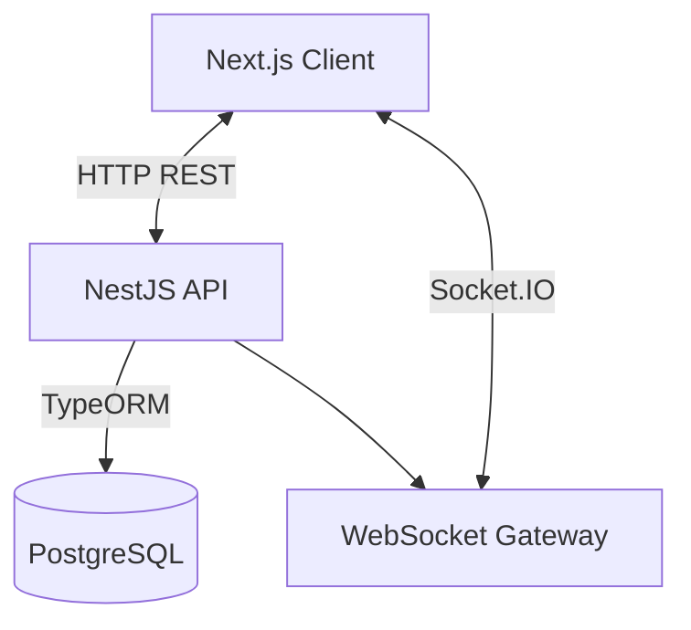
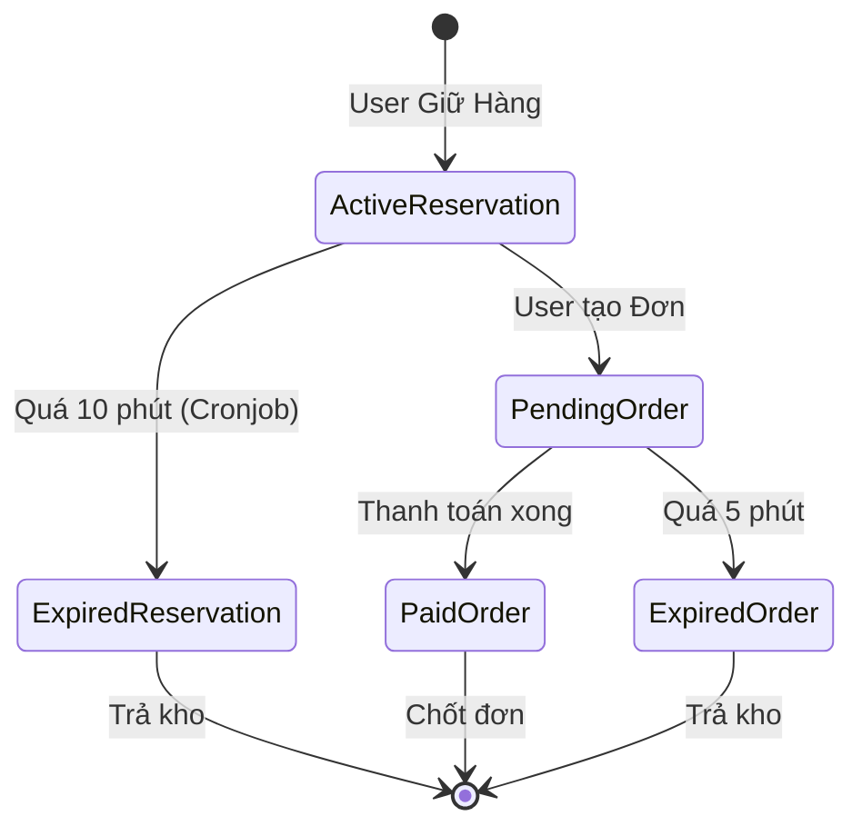

# Tài liệu Thiết kế Hệ thống

## 1. Tổng quan Kiến trúc
Hệ thống Flash Sale được xây dựng theo mô hình Client-Server tách biệt, kết nối qua REST API và WebSocket.

### Sơ đồ Thành phần


*   **Next.js Client**: Render giao diện, gọi API lấy dữ liệu tĩnh, lắng nghe Socket sự kiện động.
*   **NestJS API**: Xử lý logic nghiệp vụ, transaction, locking (chống race condition).
*   **PostgreSQL**: Lưu trữ dữ liệu, thực hiện khóa dòng (Row-level Locking) để đảm bảo toàn vẹn dữ liệu.

---

## 2. Kiểm soát Đồng thời (Concurrency Control)
Vấn đề cốt lõi của Flash Sale là **Race Condition** (Điều kiện đua) khi hàng nghìn người cùng mua một sản phẩm.

### Giải pháp: Pessimistic Locking
Chúng tôi sử dụng **Pessimistic Write Lock** (`FOR UPDATE`) của PostgreSQL.

### Luồng xử lý chi tiết (Flow)
Khi user gọi API `createReservation`:
1.  **Start Transaction**: Mở transaction mới.
2.  **Lock & Read**: Đọc thông tin sản phẩm và KHÓA dòng đó lại.
    ```sql
    SELECT * FROM product WHERE id = 1 FOR UPDATE;
    ```
    *Các request khác muốn đọc dòng này sẽ phải CHỜ (Wait) đến khi transaction này xong.*
3.  **Validate**: Kiểm tra `availableStock >= requestedQty`. Nếu không đủ -> Rollback & Error.
4.  **Update**: Trừ `availableStock`, tăng `reservedStock`.
5.  **Commit**: Lưu xuống DB và giải phóng khóa.

-> **Kết quả**: Đảm bảo 100% không bao giờ bán quá số lượng kho, dù lượng request lớn đến đâu.

---

## 3. Quản lý Trạng thái (State Management)

### Vòng đời Đơn hàng
1.  **Reservation (Giữ chỗ)**:
    *   Tồn tại trong 10 phút (TTL).
    *   Nếu user không mua -> Tự động hết hạn (Cronjob quét mỗi phút) -> Trả lại kho (`Release Stock`).
2.  **Order (Đơn hàng)**:
    *   Tạo từ Reservation đang `Active`.
    *   Trạng thái: `PENDING_PAYMENT` -> `PAID` (Thành công) hoặc `EXPIRED` (Hết hạn thanh toán).

### Sơ đồ Trạng thái


---

## 4. Realtime Strategy
Thay vì để Client liên tục gọi API (Polling) gây tải server, hệ thống dùng **Socket.IO** để đẩy dữ liệu (Push):
*   Khi Backend thay đổi tồn kho (sau transaction thành công) -> Emit event `stock_updated`.
*   Client nhận event -> Cập nhật số hiển thị ngay lập tức (không cần reload trang).

### Các sự kiện chính:
*   `stock_updated`: Cập nhật tồn kho real-time.
*   `order_created`: Báo admin có đơn mới.
*   `order_paid`: Báo admin đơn đã thanh toán.

---

## 5. Idempotency (Chống trùng lặp)
Để đảm bảo an toàn giao dịch (ví dụ: user bấm nút mua 2 lần), hệ thống sử dụng **Idempotency Key**:
- Client sinh một `key` unique (UUID) cho mỗi hành động mua hàng.
- Server kiểm tra `key` này trong database:
    - Nếu đã tồn tại -> Trả về kết quả cũ (Thành công/Thất bại) mà không xử lý lại.
    - Nếu chưa tồn tại -> Xử lý và lưu key.

## 6. Chiến lược Database & Redis
Theo yêu cầu, Redis là tùy chọn. Trong phạm vi dự án này, chúng tôi quyết định **KHÔNG sử dụng Redis** vì:
1.  **Đơn giản hóa kiến trúc**: Giảm bớt dependencies giúp việc setup và chạy test dễ dàng hơn (chỉ cần Docker Postgres).
2.  **Độ tin cậy của PostgreSQL**: Với bài toán Flash Sale quy mô nhỏ/trung bình (test), việc dùng `SELECT ... FOR UPDATE` của Postgres đủ nhanh và đảm bảo tính nhất quán dữ liệu (Strong Consistency) tốt hơn so với việc đồng bộ cache Redis - DB.
3.  **Quản lý State**: Trạng thái Reservation (Giữ chỗ) được lưu trực tiếp trong DB (bảng `reservation`) cho phép truy vết và Audit Log dễ dàng, không sợ mất dữ liệu khi Redis sập.
