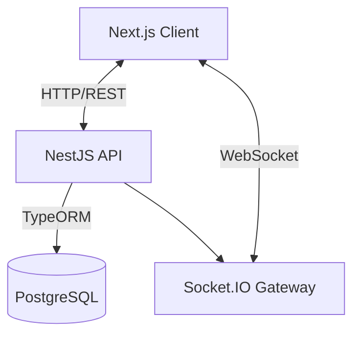
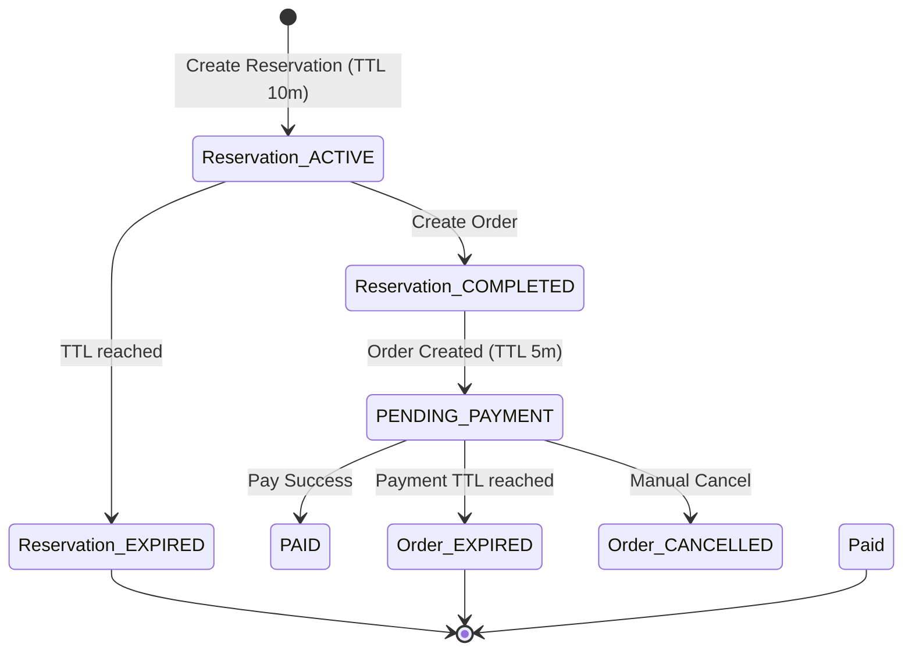

# Tài liệu Thiết kế Hệ thống

## 1. Tổng quan Kiến trúc
Dự án này là một hệ thống e-commerce Flash Sale chịu tải cao được xây dựng với:
- **Frontend**: Next.js 14 (App Router) với `shadcn/ui` và WebSocket client.
- **Backend**: NestJS với TypeORM, xử lý logic nghiệp vụ và WebSocket gateway.
- **Database**: PostgreSQL để lưu trữ dữ liệu bền vững.
- **Realtime**: Socket.IO để phát các cập nhật tồn kho và sự kiện đơn hàng.

### Sơ đồ Thành phần


---

## 2. Kiểm soát Đồng thời (Chống Oversell)
Để ngăn chặn bán quá số lượng (overselling) trong các đợt flash sale, chúng tôi sử dụng **Pessimistic Locking** (`SELECT ... FOR UPDATE`) ở cấp cơ sở dữ liệu.

### Cơ chế
1. **Bắt đầu Giao dịch (Transaction Start)**: Một DB transaction được khởi tạo.
2. **Khóa (Locking)**: Khi giữ chỗ (reserve) sản phẩm, chúng tôi lấy entity `Product` với khóa pessimistic write:
   ```typescript
   manager.findOne(Product, {
       where: { id: itemDto.productId },
       lock: { mode: 'pessimistic_write' }
   });
   ```
3. **Kiểm tra (Validation)**: Kiểm tra xem `availableStock >= requestedQuantity`.
4. **Cập nhật (Update)**: Giảm `availableStock` và tăng `reservedStock`.
5. **Commit**: Lưu các thay đổi và commit transaction.
6. **Giải phóng (Release)**: Khóa chỉ được giải phóng sau khi transaction commit hoặc rollback.

Điều này đảm bảo rằng các yêu cầu đồng thời cho cùng một sản phẩm được database xử lý tuần tự, đảm bảo cập nhật tồn kho nguyên tử (atomic).

---

## 3. Máy Trạng thái (State Machine) Giữ chỗ & Đơn hàng

### Thực thể (Entities)
- **Reservation**: Giữ tồn kho tạm thời.
- **Order**: Được tạo từ một reservation hợp lệ.

### Trạng thái Reservation
- `ACTIVE`: Tồn kho đang được giữ (`reservedStock`).
- `COMPLETED`: Đã chuyển đổi thành Order.
- `EXPIRED`: Quá thời gian TTL, tồn kho được trả lại `availableStock`.
- `CANCELLED`: Người dùng hủy thủ công.

### Trạng thái Order
- `PENDING_PAYMENT`: Đã tạo, chờ thanh toán.
- `PAID`: Thanh toán thành công (`reservedStock` -> `soldStock`).
- `EXPIRED`: Quá thời gian thanh toán TTL, tồn kho được trả lại.
- `CANCELLED`: Admin/Người dùng hủy, tồn kho được trả lại.

### Sơ đồ Chuyển đổi Trạng thái


---

## 4. Triển khai Tính Idempotency
Các thao tác quan trọng hỗ trợ tính idempotency bằng cách sử dụng `idempotencyKey` được gửi từ client.
- **Create Reservation**: Kiểm tra xem `idempotencyKey` có tồn tại trong bảng `Reservation` không. Nếu có, trả về reservation hiện có.
- **Create Order**: Kiểm tra xem `idempotencyKey` có tồn tại trong bảng `Order` không.
- **Pay Order**: Kiểm tra xem `paymentId` (được sử dụng làm key) có tồn tại không.

---

## 5. Sự kiện Realtime
Socket.IO được sử dụng để phát các sự kiện tới các client đang kết nối:
- `stock_updated`: Gửi khi tồn kho thay đổi (giữ chỗ, hết hạn, thanh toán).
- `reservation_created`, `reservation_expired`: Cho việc giám sát của admin.
- `order_created`, `order_paid`: Cho việc giám sát của admin.

Frontend lắng nghe các sự kiện này để cập nhật giao diện ngay lập tức mà không cần refresh thủ công.
